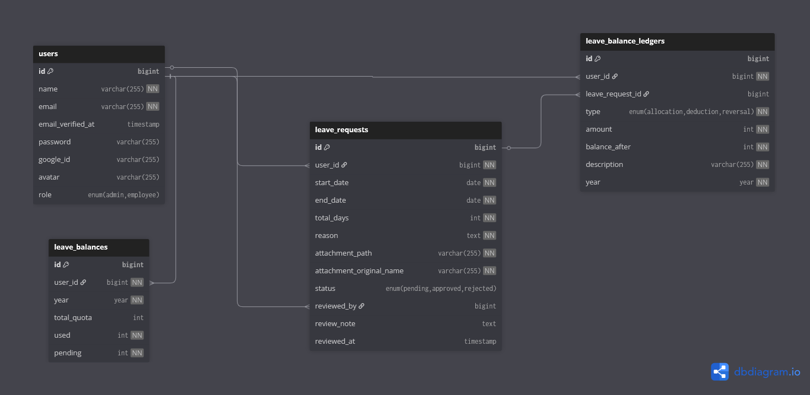

# Leave Management System API

RESTful API untuk sistem manajemen cuti karyawan, dibangun dengan **Laravel 13** dan **MySQL**.

---

## Tech Stack

| Layer | Technology |
|-------|-----------|
| Framework | Laravel |
| Database | MySQL |
| Authentication | JWT (php-open-source-saver/jwt-auth) |
| OAuth | Laravel Socialite |
| Language | PHP |

---

## Arsitektur & Alur Sistem

### Flow Request

```
HTTP Request
    │
    ▼
[Middleware] ─── auth:sanctum (token validation)
    │              └── role:admin/employee (role check)
    ▼
[Form Request] ─── Validasi input (rules, messages)
    │
    ▼
[Controller] ─── Menerima request, memanggil Service
    │
    ▼
[Service] ─── Business logic (kalkulasi, validasi bisnis, transaksi DB)
    │
    ▼
[Model] ─── Eloquent ORM (query database)
    │
    ▼
[API Resource] ─── Format response JSON
    │
    ▼
HTTP Response (JSON)
```

### Features

1. **Leave Balance Ledger System**
   - Setiap perubahan saldo cuti dicatat seperti transaksi keuangan (debit/kredit)
   - Tipe transaksi: `allocation` (alokasi tahunan), `deduction` (pengajuan), `reversal` (pengembalian saat rejected)
   - Employee bisa melihat riwayat perubahan saldo cuti

2. **Business Day Calculation**
   - Sistem menghitung hari kerja saja (exclude Sabtu & Minggu)
   - Jika ajukan cuti Senin-Jumat, total_days = 5 (bukan 7)

3. **Overlap Detection**
   - Sistem mencegah pengajuan cuti yang tanggalnya bertabrakan dengan cuti pending/approved yang sudah ada

4. **Admin Dashboard Statistics**
   - Endpoint khusus yang menampilkan ringkasan: total employee, pending requests, approved/rejected bulan ini

---

## Database Schema



---

## Panduan Instalasi & Setup

### Prerequisites

- PHP
- Composer
- MySQL
- Git

### Langkah Instalasi

```bash
# 1. Clone repository
git clone https://github.com/2byte36/seal-backend.git
cd seal_backend

# 2. Install dependencies
composer install

# 3. Copy dan setup environment file
cp .env.example .env

# 4. Generate application key
php artisan key:generate

# 5. Buat database MySQL
mysql -u root -e "CREATE DATABASE leave_management;"

# 6. Jalankan migration dan seeder
php artisan migrate --seed

# 7. Buat symbolic link untuk storage
php artisan storage:link

# 8. Jalankan server
php artisan serve
```

### Setup .env

Edit file `.env` sesuai environment lokal:

```env
# Database
DB_CONNECTION=mysql
DB_HOST=127.0.0.1
DB_PORT=3306
DB_DATABASE=leave_management
DB_USERNAME=root
DB_PASSWORD=your_password

# Google OAuth (opsional, untuk fitur login Google)
GOOGLE_CLIENT_ID=your-google-client-id
GOOGLE_CLIENT_SECRET=your-google-client-secret
GOOGLE_REDIRECT_URI=http://localhost:8000/api/v1/auth/google/callback

# Leave quota
LEAVE_QUOTA_PER_YEAR=12
```

### Akun Demo (setelah seeding)

| Role | Email | Password |
|------|-------|----------|
| Admin | admin@example.com | password |
| Employee | budi@example.com | password |
| Employee | siti@example.com | password |
| Employee | ahmad@example.com | password |
| Employee | dewi@example.com | password |
| Employee | eko@example.com | password |

---

## API Endpoints

### Authentication

| Method | Endpoint | Deskripsi | Auth |
|--------|----------|-----------|------|
| POST | `/api/v1/auth/register` | Register user baru | No |
| POST | `/api/v1/auth/login` | Login konvensional | No |
| GET | `/api/v1/auth/google` | Get Google OAuth URL | No |
| GET | `/api/v1/auth/google/callback` | Google OAuth callback | No |
| GET | `/api/v1/auth/me` | Get current user info | Yes |
| POST | `/api/v1/auth/logout` | Logout (invalidate JWT) | Yes |
| POST | `/api/v1/auth/refresh` | Refresh JWT token | Yes |

### Leave Requests

| Method | Endpoint | Deskripsi | Role |
|--------|----------|-----------|------|
| GET | `/api/v1/leaves` | List leave requests (own/all) | All |
| POST | `/api/v1/leaves` | Submit leave request | Employee |
| GET | `/api/v1/leaves/{id}` | Detail leave request | All |
| GET | `/api/v1/leaves/{id}/attachment` | Download attachment | All |

### Employee Balance

| Method | Endpoint | Deskripsi | Role |
|--------|----------|-----------|------|
| GET | `/api/v1/my/balance` | Get own leave balance | All |
| GET | `/api/v1/my/ledger` | Get balance transaction history | All |

### Admin

| Method | Endpoint | Deskripsi | Role |
|--------|----------|-----------|------|
| GET | `/api/v1/admin/dashboard` | Dashboard statistics | Admin |
| GET | `/api/v1/admin/employees` | List employees + balances | Admin |
| GET | `/api/v1/admin/employees/{id}/balance` | Employee balance detail | Admin |
| PATCH | `/api/v1/admin/leaves/{id}/review` | Approve/Reject leave | Admin |

### Penggunaan Token

Setelah login/register, gunakan token di header:

```
Authorization: Bearer <your-token>
```

---

## Workflow Status Cuti


## Postman Documentation

Link Postman: *(akan ditambahkan)*

---

## Notes

- **API Versioning**: Semua endpoint menggunakan prefix `/api/v1/` untuk mendukung versioning di masa depan
- **Soft Deletes**: User dan LeaveRequest mendukung soft delete untuk menjaga integritas data
- **File Upload**: Attachment disimpan di `storage/app/leave-attachments/` dengan validasi tipe file (PDF, JPG, PNG, DOC, DOCX) dan max 5MB
- **Pagination**: Semua list endpoint mendukung pagination via query parameter `per_page`
- **Filter**: Admin bisa filter leave requests berdasarkan `status` dan `user_id`
